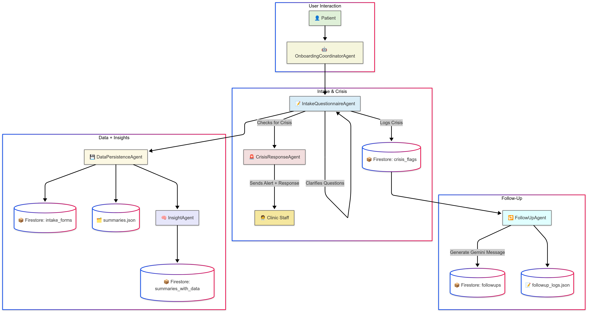

🧠 CompassionateConnect AI  
*Empathetic Multi-Agent Mental Health Onboarding System using Gemini + Firestore*

> Built for the Google Cloud Multi-Agent Hackathon · June 2025

 

---

🚨 The Problem

Mental health clinics are overwhelmed with intake admin work. Patients feel unseen, crisis moments go unnoticed, and clinicians don’t get usable summaries before sessions. And they have to do so many tasks that distract them and burden them from giving their full to the patient.

---

💡 My Solution

**CompassionateConnect AI** is a multi-agent system that reimagines mental health onboarding using conversational AI.

It:
- Uses Gemini to clarify patient responses in real time
- Detects crisis phrases and initiates a follow-up protocol
- Summarizes intake sessions into therapist-friendly briefs
- Suggests potential therapy areas using **non-diagnostic AI**
- Stores everything in Firestore + local JSON

---

🧠 Architecture



---

🤖 Agent Overview

| Agent                     | Role                                                                    |
|---------------------------|-------------------------------------------------------------------------|
| `OnboardingCoordinatorAgent` | Orchestrates the full flow from intake to summary                     |
| `IntakeQuestionnaireAgent`  | Asks, validates, and clarifies patient responses (Gemini-powered)     |
| `CrisisResponseAgent`       | Detects crisis indicators and logs high-priority cases                |
| `SummaryGeneratorAgent`     | Converts responses into natural language summaries                    |
| `InsightAgent`              | Suggests possible therapy directions for therapists                   |
| `DataPersistenceAgent`      | Saves to Firestore and local JSON for dashboard use                   |

---

🧪 Try It Out (Local CLI Demo)

```bash
git clone https://github.com/yourusername/compassionateconnect-ai.git
cd compassionateconnect-ai
pip install -r requirements.txt

# Start the intake flow:
python onboarding_coordinator_agent.py

# View the therapist dashboard:
python therapist_dashboard.py
````

You’ll experience a fully guided, AI-powered intake simulation — with clarifications, summaries, and ethical insights.

---

🧰 Tech Stack

* 🧠 Gemini 1.5 Flash (via `google.generativeai`)
* 🔐 Firestore for real-time clinician-side storage
* 🐍 Python multi-agent architecture
* 🗃️ JSON for local offline demo + backups
* 💬 Command-line interface

---

📺 Demo Video

👉 [Watch demo (2:12)](https://www.youtube.com/watch?v=exSmOzVHLIg&ab_channel=SreenidhiVedartham%28Needhi%29)

---

🧾 Therapist Dashboard

The dashboard:

* Displays client summaries
* Shows ethically filtered Gemini-generated insights
* Flags any crisis-detected users for immediate follow-up

---

🧠 Ethical AI Design

* ❌ No diagnoses — only therapist-facing suggestions
* 💬 Clear disclaimers in every AI insight
* 🛡️ Simulated patient data only
* 👥 Built to augment, not replace, human clinicians

---

📘 Notion Documentation

👉 [View full Notion project book](https://www.notion.so/CompassionateConnect-AI-20eb2f6a587d809194b4dfadbf393ebb?source=copy_link)

---

🧭 Project Files (Flat Structure)

```
compassionateconnect-ai/
├── agents/
├── intake_agent.py
├── crisis_response_agent.py
├── summary_generator_agent.py
├── insight_agent.py
├── data_persistence_agent.py
├── onboarding_coordinator_agent.py
├── therapist_dashboard.py
├── summaries.json
├── follow_up_log.json
├── requirements.txt
├── README.md
└── LICENSE
```

---

🧠 For Judges

✅ Multi-Agent GenAI system
✅ Gemini 1.5 Flash + Firestore integration
✅ Crisis-aware, ethically aligned
✅ Dashboard for therapists
✅ Notion doc + demo included

---

📜 License

This project is licensed under the MIT License.