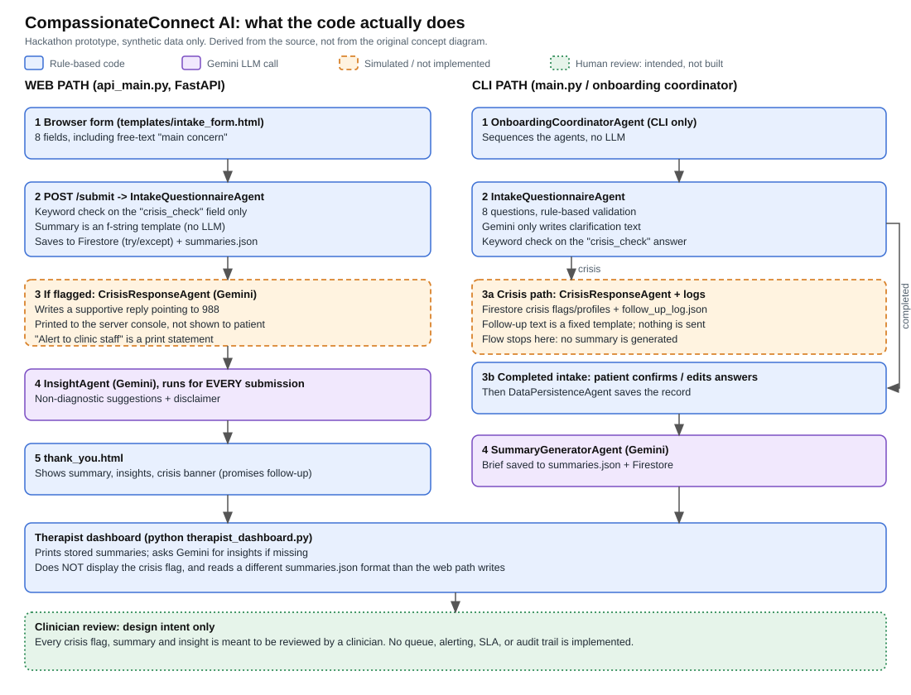

# Case Study: CompassionateConnect AI

*A retrospective on a multi-agent intake prototype. Written September 2026 about a hackathon project built in June 2025.*

> **Read this as a design-and-judgment case study, not a product claim.**
> The prototype used synthetic data only, had no users, and made no measured
> outcomes. It is not a clinical system and not HIPAA-compliant. Section 9 lists
> what is evidenced by the repo and what is not.

## 1. The problem I picked

Mental-health clinics spend a lot of clinician and staff time on intake:
collecting details, spotting urgent cases, and preparing a usable summary before
the first session. The hackathon brief was to build a multi-agent system, so I
asked: **which parts of intake are separable enough to give to specialised
agents, and which must stay with a human?**

I did not interview clinicians. The user needs below are my assumptions and
would be the first thing to validate.

| Person | What they likely need (assumed, not researched) |
|--------|--------------------------------------------------|
| Patient | A low-friction, respectful intake; clarity on why each question is asked; immediate safety information if in distress |
| Intake staff | Complete, validated records without chasing patients |
| Therapist | A short, accurate brief before the session; urgent cases surfaced first |
| Clinic operations | Fewer no-shows and less admin time (a hypothesis I never measured) |

## 2. Scope decisions

- **In scope:** structured intake questions, answer validation, a crisis check, a therapist-facing summary, non-diagnostic "possible directions" for the therapist, local and cloud persistence.
- **Deliberately out of scope:** diagnosis, treatment recommendations to patients, EHR integration, authentication, real patient data.
- **Non-negotiable design rule:** the AI never produces a diagnosis and its output is addressed to a clinician, not the patient.

## 3. Agent design

| Agent | Responsibility | Uses an LLM? | Human-review relevance |
|-------|----------------|:------------:|------------------------|
| Intake questionnaire | Ask, validate, clarify | Only for clarification wording | Patient confirms answers (CLI) |
| Crisis response | Supportive message; direct to 988 | Yes | Intended to trigger clinician follow-up; **not implemented** |
| Summary generator | Draft clinician brief | Yes | Clinician must verify; never sole source |
| Insight | "Possible directions" + disclaimer | Yes | Suggestions only |
| Persistence | Store records | No | Needs audit trail; **not implemented** |
| Coordinator | Sequence the above | No | n/a |

The important honesty point: the agents are Python classes called in sequence.
There is no message bus, shared schema, or independent deployment. That is
adequate for a demo and is the main thing I would change (section 6).

## 4. Human-review design

The most useful exercise in this project was mapping where a human must be in
the loop. My current view:

| Decision point | Automated today | Should be |
|----------------|-----------------|-----------|
| Is this patient possibly in crisis? | Keyword match on one field | Any positive signal, from any field, **routes to a clinician**; the system never closes a case as "no risk" on its own |
| What is said to a patient in distress? | LLM-written text, shown only in a server log on the web path | Fixed, clinically approved safety text shown immediately; LLM text not used for this |
| What does the therapist see first? | Nothing prioritised; dashboard does not show the crisis flag | Crisis-flagged cases at the top with a required acknowledgement |
| Is the summary accurate? | Not checked | Clinician reviews against the raw intake; discrepancies logged |
| Are the insights appropriate? | Disclaimer in prompt | Clinician-only visibility; never shown to patient |

## 5. What I found when I audited the code

I re-audited the repo in September 2026. Being specific about the gaps is the
point of this case study.

1. **Crisis detection is a substring match.** It uses a short keyword list and is applied only to the yes/no `crisis_check` field. Matching short terms as substrings gives accidental results. Tested against the same logic:
   - `"Not really"` and `"I don't want to be here anymore"` are flagged, but only because they contain the letter `y`, which is in the keyword list.
   - `"I keep thinking about ending things"` is **not** flagged.
   - Free text in "main concern" is never screened at all, even though that is where distress is most likely to be described.
2. **The "alert to clinic staff" is a `print` statement.** The thank-you page tells the patient a professional "will follow up immediately". Nothing in the code makes that true.
3. **The dashboard ignores crisis.** `therapist_dashboard.py` never reads the crisis flag.
4. **The two entry points diverge.** The web path skips the coordinator, summary and persistence agents and uses a string template for its summary. It also writes `summaries.json` in a different format than the dashboard reads.
5. **Configuration is inconsistent.** Two different API-key variable names are required, one file hardcodes a placeholder, and no example env file exists.
6. **There were no automated tests and no evaluation** before this review. Only manual scripts, one of which would crash. I have since added the crisis-check harness in `eval/`.
7. **Early public messaging overclaimed.** Early README versions called the system "production-ready" and "HIPAA-compliant". Neither was true and I have removed those claims. They remain visible in old commits.

## 6. What I'd change (in priority order)

1. **Crisis routing that fails safe.** Screen all free text; treat any uncertainty as "needs human review"; keep a human-approved fixed message for the patient; make the clinician-facing flag impossible to miss.
2. **Grow the evaluation harness** (crisis screening is done, section 7): clinician-reviewed labels, a summary-fidelity check against the raw intake, and a regression gate in CI.
3. **Explicit agent contracts.** Typed input/output schemas per agent (for example with Pydantic), one orchestration path shared by web and CLI, and a queue for handoffs.
4. **A single source of truth for storage** and an audit log of who saw what.
5. **Operational basics:** config via environment, `.env.example`, a working test suite, CI, and pinned model versions.

## 7. Evaluation: crisis check run, summaries and insights not yet

I built a small mock-mode harness (`eval/run_eval.py`) that runs 40 synthetic
intake forms through the repo's real `process_form_submission`, with the Gemini
and Firestore SDKs stubbed out. It is deterministic and needs no keys, network
or spend. Full tables: [`eval/results.md`](../eval/results.md).

**Caveat first:** the cases are phrases I wrote and the labels are my own
judgement. No clinician reviewed them. This is a development set that exposes
gaps, not a validation study. "Positive" means "route to a human"; uncertain or
declined answers are labelled positive on purpose.

| Metric (current detector) | Result |
|---------------------------|--------|
| Recall on risk cases | 12/23 = 0.52 |
| Precision | 12/18 = 0.67 |
| False-positive rate | 6/17 = 0.35 |
| Risk cases flagged only via the letter `y` inside another word | 5 of the 12 flagged |
| False alarms caused only by `y` inside another word | 3 of 6 |
| Risk stated only in `main_concern` | 0/5 caught |

Recall is 0.30 if the accidental `y` matches are not credited, and 0.50 if the
ambiguous cases are dropped, so the headline is not an artefact of my labelling
choices. Explicit terms and a plain "yes" were caught; indirect wording,
misspellings, non-English answers and anything outside `crisis_check` were not.

Not yet evaluated: summary fidelity against the source intake, and insight
safety (no diagnostic language). Those need LLM output and would be scored the
same way, with a clinician agreeing the pass bar.

## 8. If this were a real program

The project taught me more about program design than about the model:

- **Stakeholders:** clinical lead (owns safety decisions), privacy/compliance, clinic operations, IT, and patients or a patient advocate.
- **Gating:** compliance and clinical sign-off are launch gates, not later polish. A clinical-safety review would come before any pilot.
- **Phasing:** internal synthetic-data pilot → shadow mode (AI output compared against clinician judgement, never acted on) → supervised pilot with a small clinic.
- **Adoption risks:** clinician trust, added review burden if summaries are inaccurate, and patient consent and comfort with AI in a sensitive setting.
- **Success measures to define up front:** crisis-review turnaround time, clinician time saved per intake, summary correction rate, and patient completion rate. None of these were measured here.

## 9. What this repo does and doesn't prove

| Evidenced by the repo | Not evidenced |
|-----------------------|---------------|
| A working multi-step intake prototype (CLI and web) built during a hackathon | Real users, pilots, or measured time savings |
| Deliberate non-diagnostic, clinician-facing design | HIPAA compliance or any regulatory review |
| Honest post-hoc analysis of failure modes | Clinical validity of the crisis check or the insights |
| A follow-on serverless prototype on AWS (see below) | Production readiness or scale |

## 10. Follow-on: AWS prototype

[Therapist-Dashboard-AWS](https://github.com/Hereforlolz/Therapist-Dashboard-AWS)
explored a serverless version: Lambda, API Gateway, DynamoDB, and Claude on
Bedrock, with a React dashboard. It is also archived and carries known
limitations (no authentication, open CORS, broad IAM permissions, no
compliance work) documented in its README.

## 11. Repo history note

The original concept diagram is kept as `original-concept-architecture.png` for
comparison. It shows a follow-up step, Gemini-based validation, and a
dashboard flag that the code does not implement.
